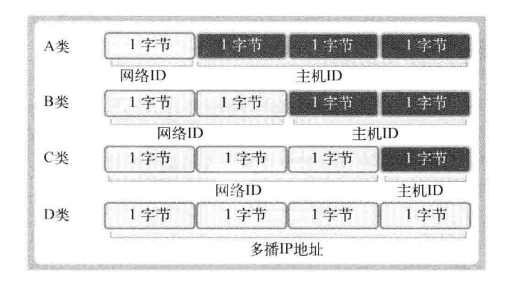
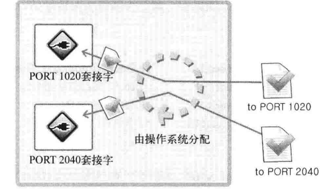
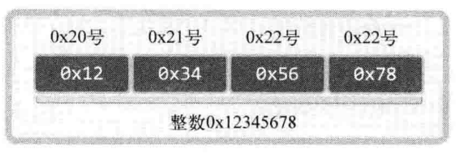
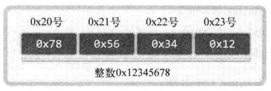

## 地址族与数据序列  

### 3.1 分配给套接字的IP接口与端口号  

IP是网络协议的简写，是为收发网络数据而分配给计算机的值。  

端口号并非赋予计算机的值，而是为区分程序中创建的套接字而分配给套接字的序号  

#### 网络地址(Internet Address)  

IP地址分为两种  

1. IPv4 -> 4字节地址族
2. IPv6 -> 16字节地址族  

IPv4和IPv6的差别主要是表示IP地址所用的字节数。  

IPv4标准的5字节IP地址分为网络地址和主机地址，分为A、B、C、D、E等类型  

  

网络地址是为区分网络而设置的一部分IP地址。

向某IP传送信息，一般先向网络地址传数据，在找目标主机。(具体知识在计网中会学到，这里不细说。)  

#### 网络地址分类与主机地址边界  

1. A类首字节范围：0~127
2. B类首字节范围：128~191
3. C类首字节范围：192~223

一种简单的区分方式，看二进制的前几位

1. A类：0开头
2. B类：10开头
3. C类：110开头

#### 用于区分套接字的端口号

IP用于区分计算机，但最终的程序不能用IP区分。  

应用程序的最终选择需要通过 **端口号** 确认。

计算机中配有NIC(网卡)数据传输设备。通过NIC向计算机内部传输数据时会用到IP。  

操作系统负责将传递到内部的数据适当分配给套接字，这时就要利用端口号。  

也就是说NIC接受的数据内部就有端口号，操作系统参考此端口号把数据传输给相应端口的套接字。  

端口号不能重复，但是TCP和UDP不会公用套接字，所以允许重复。

  

> NIC就是所谓的网卡，很重要
>
> 主要功能就是让计算机接入网络，从而进行数据传输
>
> 具体说  将计算机中的数据转化为串行数据，格式化数据包，根据硬件MAC地址传输，接受数据

### 3.2 地址信息的表示

围绕**IPv4**展开

填写地址信息时，围绕以下问题进行

> 问题1：采用哪种地址族？
>  
> 答案1：基于IPv4  
>
> 问题2：IP地址是多少
>  
> 答案2：211.204.214.76
>
> 问题3：端口号是多少
>  
> 答案3：2048

根据上述问答，我们可以自然的推出IPv4的结构体

```c
struct sockaddr_in
{
  sa_family_t     sin_family;   //地址族
  uint16_t        sin_port;     //16位端口号
  struct in_addr  sin_addr;     //32位IP地址
  char            sin_zero[8]   //不使用
}
```

其中 struct in_addr结构体如下  

```c
struct in_addr
{
  In_addr_t       s_addr;       //32位IPv4地址
}
```

> 区分一下地址族和协议族，很容易搞混
>
> 协议族是协议的集合，IPv4，IPv6
>
> 地址族是网络地址表示方式的集合，32位地址，128位地址

#### 结构体sockaddr_in的成员分析

成员**sin_family**

每种协议族适用的地址族不同。比如，IPv4使用4字节地址族，IPv6使用16字节地址族。

| 地址族    | 含义  |
|---|---|
| AF_INET   | IPv4网络中使用的地址族  |
| AF_INET6  | IPv6网络中使用的地址族  |
| AF_LOCAL  | 本地通信采用的UNIX协议的地址族  |

成员**sin_port**
保存16位端口号，重点在于，它以网络字节序保存。

成员**sin_addr**
该成员保存32位IP地址信息，且也以网络字节序保存。为理解好该成员同时要观察它的结构体，in_addr，发现它声明为uint32_t，因此当作32位整数即可

成员**sin_zero**

无特殊含义。为了让sockaddr和sockaddr_in大小保持一致而插入的成员。填充为0。  

> 为什么要这样做呢？
>
> bind() 函数第二个参数为 sockaddr结构体

```c
struct sockaddr {
  sa_family    sin_family;       //地址族
  char         sa_data[14];      //地址信息
};
```

可以发现，sockaddr多出来了8位0，对于地址信息来说这很麻烦，因此有了新的结构体，sockaddr_in  

### 3.3 网络字节序与地址变换

不同CPU在保存数据时可能会用到不同的形式

如下，1可以用两种方式存储

00000000 00000000 00000000 00000001

00000001 00000000 00000000 00000000  

这代表着CPU解析数据的两种方式

1. 大端序：高位字节存放在低位地址
2. 小端序：高位字节存放在高位地址



  

目前主流的intel系列CPU以小端序方式保存数据

因此不同计算机在传输数据时要统一方式

规定 ***统一使用大端序*** 传输数据，这种约定称为网络字节序  

#### 字节序转化

1. unsigned short htons(unsigned short)
2. unsigned short ntohs(unsigned short)
3. unsigned long htonl(unsigned long)
4. unsigned long ntohl(unsigned long)

> htons中的h代表主机字节序
>
> htons中的n代表网络字节序
>
> s指的是short，l指的是long，Linux中long占4字节
>
> htons 可以解释为把short型数据从主机字节序转化为网络字节序
>
> ntohs 把short型数据从网络字节序转化为主机字节序
>
> 通常，以s作为后缀的函数中，s代表2个字节short，因此用于端口号转换
>
> 以l作为后缀的函数中，l代表4个字节，用于IP地址转换

我们有必要编写与大小端无关的代码，不能因为电脑本身就是大端的就不进行转化

注意 **不需要在数据传输前和接受数据时转换成网络字节序**，因为有自动转化机质。

除了向 **sockaddr_in**结构体填充数据外，无需考虑字节序问题。

#### 将字符串信息转换为网络字节序的整数型

sockaddr_in中的sin_addr保存的地址信息为32位整数型。

对于我们而言，分配32位整数型数据是非易事，因此可以尝试将IP地址转换为4字节整数型数据

对于IP地址的表示，我们熟悉点分十进制表示法，而非整数型数据表示法。

因此，我们将使用函数将字符串形式的IP地址转化为32位整数型数据。**同时也会进行网络字节序转换**

```c
#include <arpa/inet.h>

in_addr_t inet_addr(const char *string);

//成功时返回32位大端序整数型值，失败时返回INADDR_NONE
```

如我们传入“211.214.107.99”，函数会自动转化为32位数据并返回。且满足网络字节序，返回值内部声明为32位整数。

调用过程见 [inet_addr函数](inet_addr.c)

从输出来看，inet_addr不仅可以转换IP，将其变成32位整数类型，而且还能检查IP是否合法。

在介绍一个函数，inet_aton()，其功能与inet_addr完全相同。只不过它利用了in_addr结构体，且使用更平凡

```c
#include <arpa/inet.h>

int inet_aton(const char &string, struct in_addr *addr);

//string  需要转换的IP字符串
//addr保存转换结果的in_addr结构体变量的地址
//成功时返回1(true), 失败时返回0(false)。
```

结构体in_addr

```c
struct in_addr {
  in_addr_t s_addr;
};
```

实际编程中用inet_addr，则需要将得到的数据在转化为in_addr类型

而inet_aton则不需要，会自动存为in_addr类型的值

具体由看 [inet_aton函数的演示](inet_aton.c)

> 注意运行结果，是大端表示法

在介绍一个与inet_aton完全相反的函数，inet_ntoa

此函数可以将我们熟知的网络字节序转化为字符串形式

```c
#include <arpa/inet.h>

char *inet_ntoa(struct in_addr adr);

//成功时返回转换的字符串地址值，失败时返回-1
```

传入的整数型IP地址转换为字符串格式并返回。但需要小心，返回值类型为char类型。

返回字符串地址意味着字符串已保存到内存空间，但该函数并未向程序员要求分配内存，而是在内部申请了内存并保存了字符串。

也就是说，调用完该函数后，应该立即将内容复制，否则下此调用将覆盖原值。

在这里给出示例 [inet_ntoa 函数](inet_ntoa.c)

#### 网络地址初始化(针对服务器)

结合上述知识，介绍常见的初始化方法

```c
struct sockaddr_in addr;
char *serv_ip = "211.73.168.13";
char *serv_port = "9190";
memset(&addr, 0, sizeof(addr));   //结构体变量整体初始化为0
addr.sin_family = AF_INET;
addr.sin_addr.s_addr = inet_addr(serv_ip);
addr.sin_port = htons(atoi(serv_port));
```  

但在上述例子中，IP和端口写死了，这并非良策，我们可以在main函数中传入IP和端口

#### 客户端信息初始化

声明sockaddr_in 结构体，并初始化为要与之连接的服务器端套接字的IP和端口号，然后调用connect函数。

#### INADDR_ANY

```c
struct sockaddr_in addr;
char *serv_port = "9190";
memset(&addr, 0, sizeof(addr));   //结构体变量整体初始化为0
addr.sin_family = AF_INET;
addr.sin_addr.s_addr = htonl(INADDR_ANY);
addr.sin_port = htons(atoi(serv_port));
```

利用INADDR_ANY分配服务器IP地址，可以自动获取服务器端IP。

若计算机有多个IP，只要端口一致，可以从不同IP地址接收数据。

服务器中优先考虑这个，客户端一般不用。

#### 向套接字分配网络地址

bind负责把初始化地址信息分配给套接字

```c
#include <sys/socket.h>

int bind(int sockfd, struct sockaddr *myaddr, socklen_t addrlen);
```

函数成功，第二个参数中的信息，分配给第一个参数中对应的套接字。

```c
int serv_sock;
struct sockaddr_in serv_addr;
char *serv_port = "9190";

//创建服务器端套接字(监听套接字)
serv_sock = socket(PF_INET, SOCK_STREAM, 0);

//地址信息初始化
memset(serv_addr, 0, sizeof(serv_addr));
serv_addr.sin_family = AF_INET;
serv_addr.sin_addr.s_addr = htonl(INADDR_ANY);
serv_addr.sin_port = htons(atoi(serv_port));

//分配信息
bind(serv_sock, (struct sockaddr *)serv_addr, sizeof(serv_addr));
```
