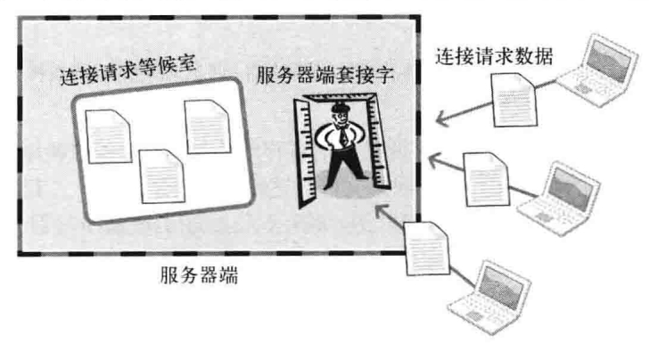
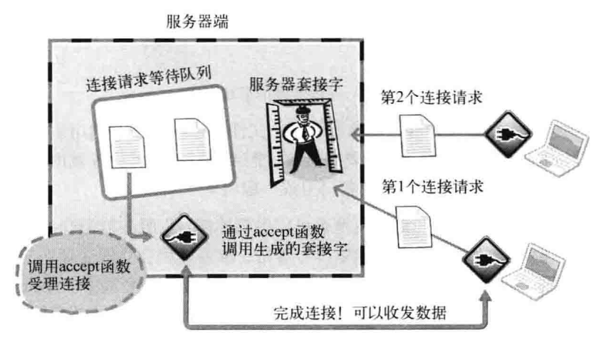
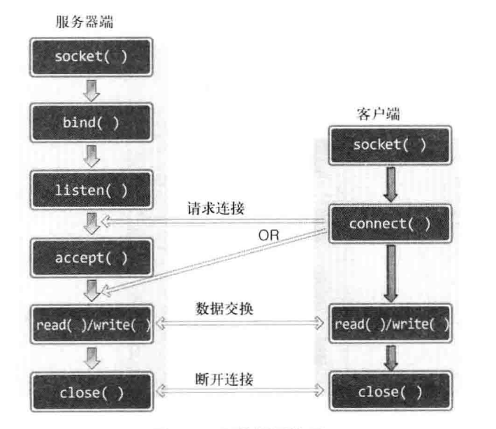

## 基于TCP的服务器端/客户端

### 4.1理解TCP和UDP

#### TCP/IP协议栈

不细展开，计网中都学过，就是传输层，网络层，链路层的事情

链路层就是物理链路标准化的结果。

IP层决定路径的选择，本身不可靠，无法解决数据错误。

tcp以IP选择后的路径为基础进行传输数据。

IP只关心一个数据包(基本单位)，即使传输多个包，每个数据包也是由IP层实际传输的。

这就可能造成一个现象，在之前章节的疑问，数据的前后到达问题。

光由IP传输，很容易造成A比B先出发，但B先到达，也可能B不到达。

这时候tcp就有用了，它可以确认接受的数据，并重传丢失的数据，因此tcp是可靠的。

### 4.2 实现基于tcp的服务器端/客户端

***进入等待连接请求状态***

1. 调用socket函数，创建套接字，并初始化结构体变量
2. bind函数向套接字分配地址
3. listen

```c
#include <sys/socket.h>

int listen(int sock, int backlog);
//成功时返回0，失败时返回01
```

sock监听套接字

backlog连接请求等待队列的长度，若为5，则队列长度为5，最多可以有5个连接请求进入队列。



如图，图中的服务端套接字就是所谓的监听套接字。

如果有客户端的请求，它会观察队列中是否有空余。

若有，则进入排队。进入 **等待连接请求状态**。

listen的第二个参数，在频繁接收请求的web服务器端至少为15。

***受理客户端连接请求***

调用listen函数后，我们需要按序处理请求，受理请求意味着进入可接受数据的状态。

这就意味着需要套接字，服务器套接字能用吗？答，不能。

因为他是做门卫用的，那怎么办呢，只能在创建一个新的套接字，并连接到发出请求的客户端。

形成一一对应。

我们不需要自己去创建，accept函数会帮我们建立。

```c
#include <sys/socket.h>

int accept(int sock, struct sockaddr *addr, socklen_t *addrlen);

//成功时返回创建的套接字文件描述符 
```

1. sock 服务器套接字的文件描述符
2. addr 保存发起连接请求的客户端地址信息的变量地址值，调用函数后向传递来的地址变量参数填充客户端地址信息。
3. addrlen 第二个参数的长度，调用函数后，填入客户端地址长度。

accept函数受理连接请求等待队列中带处理的客户端连接请求。

accept内部将产生用于数据I/O的套接字，并返回其文件描述符。其中套接字是自动生成的并且会自动与客户端建立联系。



客户端与服务器端唯一的区别在请求连接，它是创建客户端套接字后向服务器端发起的连接请求。

服务器在listen后，客户端就可以发起连接请求了

调用connect完成

```c
#include <sys/socket.h>

int connect(int sock, struct sockaddr *servaddr, socklen_t addrlen);

//成功时返回0，失败时返回-1.
```

1. sock 客户端文件描述符。
2. servaddr 保存目标服务器端地址信息的变量地址值。
3. addrlen 以字节为单位传递已传递给第二个结构体参数servaddr的地址变量长度。  

客户端connect之后，发生以下情况之一才会返回

1. 服务器接受连接请求
2. 网络中断导致连接中断

> 注意，服务器接受连接请求并不意味着服务器端调用accept函数，其实是服务器端把连接请求信息记录到等待队列。因此connect函数返回后并不立即进行数据交换。

我们发现，客户端的IP和端口号并未出现，为什么？？？

> 答：客户端的IP地址和端口号在调用connect函数时自动分配(操作系统)，无需调用bind



图中可以发现，connect必须在listen之后才能被调用

且accept可能比connect先执行，因此在accpet时要进入阻塞状态，知道客户端调用connect

#### 迭代回声服务器端/客户端

服务器同一时刻只与一个客户端相连，并提供回声服务。

[回声服务器端](echo_server.c)

[回声客户端](echo_client.c)
